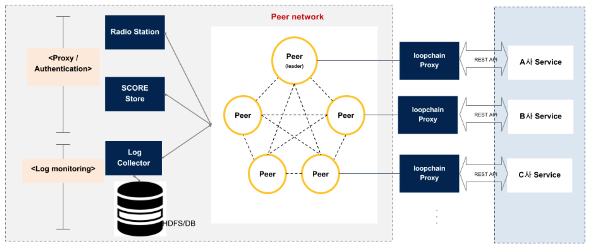

## loopchain tutorial

[https://github.com/theloopkr/loopchain_tutorial](https://github.com/theloopkr/loopchain_tutorial) 를 참조하여 진행한 부분을 기록하고 있다.

추가적으로 필요한부분들 까지 작성하려고 한다.

#### Docker 설치하기

[Get Docker CE for Ubuntu](https://docs.docker.com/install/linux/docker-ce/ubuntu/)

#### Dockerhub 에서 Docker image 받기

[Dockerhub](https://hub.docker.com/u/loopchain/)에 loopchain docker image가 올라가 있다.

* looprs: Radiostation docker images
* looppeer: Peer docker image
* loopchain-fluentd: Log를 받아서 처리하게 수정한 fluentd image이다.

#### Docker image pull 받기

~~~
$docker pull loopchain/looprs
$docker pull loopchain/looppeer
$docker pull loopchain/loopchain-fluentd
~~~

#### 포트 열기

* loopchain을 사용하기 위해 Port가 열려야 한다.

* RadioStation
	* 7102: gRPC port
	* 9002: RESTful port

* Peer
	* 7100: gRPC port
	* 9000: RESTful port

하지만 일단은 aws port는 9000, 9002, 80, 22 포트만 열어주었다.

#### 최소 Node수
제대로된 Blockchain network를 구성하기 위해서 약 4개 이상의 Node들을 띄워야한다. 예제들은 1개 혹은 2개만 띄운 예제라 보면됨.

---

### Components 들

[출처 : loopchain](https://github.com/theloopkr/loopchain/blob/master/README_KR.md)

#### Peer

새로운 Tx를 만들어서 검증을 요청한다. 그리고 새로 검증된 block을 모아 Blockchain에 저장하고 그 내용을 읽어볼 수 있게 한다.

#### Peer(Leader)

일정시간마다 네트워크의 Tx를 모아 블록을 생성하고 다른 Peer들에게 검증을 요청하며, 다수의 Peer가 검증 후 해당 블록을 공인해서 보관하는 모듈.

#### Radio Station

Peer의 추가/탈퇴/재시작시, 다른 Peer들의 주소를 알림으로써 Peer끼리 통신을 이어가게 해주는 모듈이다.

#### loopchain proxy

각 peer들에 접근을 용이하게 RESTful API를 노출해주는 모듈.

#### log collector

각 Peer들이 돌아가는 Log를 수집하는 모듈.
