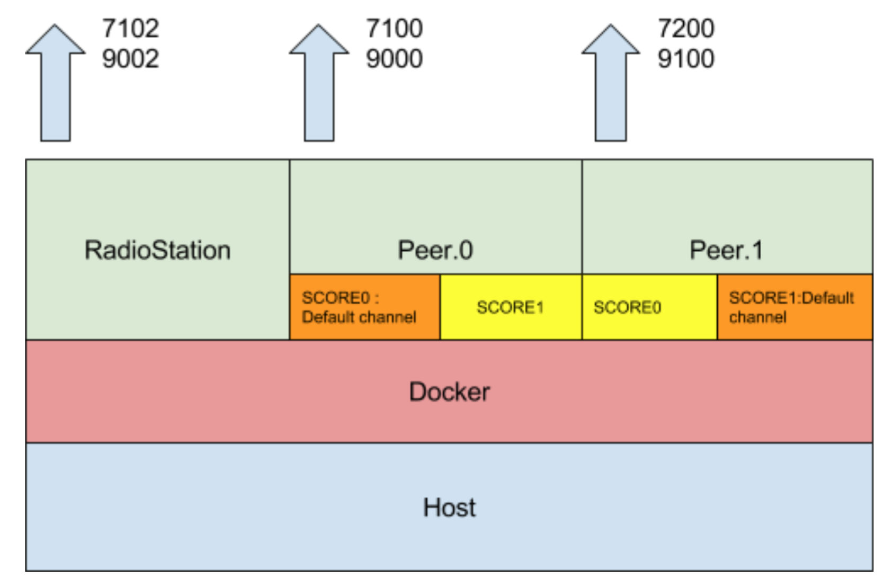

# Local computer 에서 Radiostation과 1개의 Peer로 한 장비위에서 Blockchain network 구성하기

[출처 : loopchain_tutorial](https://github.com/theloopkr/loopchain_tutorial/tree/master/step2)

### 환경변수 등록

~~~
$ export TAG=latest
~~~

### 설정파일생성

1. fluent.conf
2. channel_manage_data.json
3. rs_conf.json
4. peer_conf0.json
5. peer_conf1.json

### Docker Image 확인

~~~
REPOSITORY                    TAG                 IMAGE ID            CREATED             SIZE
hello-world                   latest              e38bc07ac18e        2 months ago        1.85kB
loopchain/looppeer            latest              8968af8c1721        6 months ago        783MB
loopchain/looprs              latest              f8bf3265a09b        6 months ago        783MB
loopchain/loopchain-fluentd   latest              95900cef2721        6 months ago        39.5MB
~~~

### Docker Container 실행

1. log서버 실행
2. RadioStation 실행
3. Peer0 실행
4. Peer1 실행

~~~
CONTAINER ID        IMAGE                                COMMAND                  CREATED             STATUS              PORTS                                                                     NAMES
2ab603405984        loopchain/looppeer:latest            "python3 peer.py -o …"   11 minutes ago      Up 11 minutes       7100-7102/tcp, 0.0.0.0:7200->7200/tcp, 9000/tcp, 0.0.0.0:9100->9100/tcp   peer1
f12aa24efafe        loopchain/looppeer:latest            "python3 peer.py -o …"   13 minutes ago      Up 13 minutes       0.0.0.0:7100->7100/tcp, 0.0.0.0:9000->9000/tcp, 7101-7102/tcp             peer0
f65a8736e820        loopchain/looprs:latest              "python3 radiostatio…"   15 minutes ago      Up 15 minutes       0.0.0.0:7102->7102/tcp, 7100-7101/tcp, 0.0.0.0:9002->9002/tcp             radio_station
213a017824c9        loopchain/loopchain-fluentd:latest   "/bin/entrypoint.sh …"   18 minutes ago      Up 18 minutes       5140/tcp, 24284/tcp, 0.0.0.0:24224->24224/tcp
~~~

### 테스트

~~~
{
  "response_code": 0,
  "data": {
    "registered_peer_count": 2,
    "connected_peer_count": 2,
    "registered_peer_list": [
      {
        "order": 1,
        "peer_id": "6c264226-80d6-11e8-80c0-0242ac110004",
        "group_id": "6c264226-80d6-11e8-80c0-0242ac110004",
        "target": "172.31.18.75:7100",
        "cert": "MFYwEAYHKoZIzj0CAQYFK4EEAAoDQgAE+HQPBowjyJnyinsYjiztl5i6hQ1JiWdpRmyFR1T283M4liQia7weerQQ4Qw6jDVwd+RkwHeenvR0xxovUFCTQg==",
        "status_update_time": "2018-07-06 04:38:48.293874",
        "status": 1,
        "peer_type": 1
      },
      {
        "order": 2,
        "peer_id": "a37fa21c-80d6-11e8-aa38-0242ac110005",
        "group_id": "a37fa21c-80d6-11e8-aa38-0242ac110005",
        "target": "172.31.18.75:7200",
        "cert": "MFYwEAYHKoZIzj0CAQYFK4EEAAoDQgAE+HQPBowjyJnyinsYjiztl5i6hQ1JiWdpRmyFR1T283M4liQia7weerQQ4Qw6jDVwd+RkwHeenvR0xxovUFCTQg==",
        "status_update_time": "2018-07-06 04:40:21.155269",
        "status": 1,
        "peer_type": 0
      }
    ],
    "connected_peer_list": [
      {
        "order": 1,
        "peer_id": "6c264226-80d6-11e8-80c0-0242ac110004",
        "group_id": "6c264226-80d6-11e8-80c0-0242ac110004",
        "target": "172.31.18.75:7100",
        "cert": "MFYwEAYHKoZIzj0CAQYFK4EEAAoDQgAE+HQPBowjyJnyinsYjiztl5i6hQ1JiWdpRmyFR1T283M4liQia7weerQQ4Qw6jDVwd+RkwHeenvR0xxovUFCTQg==",
        "status_update_time": "2018-07-06 04:38:48.293874",
        "status": 1,
        "peer_type": 1
      },
      {
        "order": 2,
        "peer_id": "a37fa21c-80d6-11e8-aa38-0242ac110005",
        "group_id": "a37fa21c-80d6-11e8-aa38-0242ac110005",
        "target": "172.31.18.75:7200",
        "cert": "MFYwEAYHKoZIzj0CAQYFK4EEAAoDQgAE+HQPBowjyJnyinsYjiztl5i6hQ1JiWdpRmyFR1T283M4liQia7weerQQ4Qw6jDVwd+RkwHeenvR0xxovUFCTQg==",
        "status_update_time": "2018-07-06 04:40:21.155269",
        "status": 1,
        "peer_type": 0
      }
    ]
  }
}
~~~
